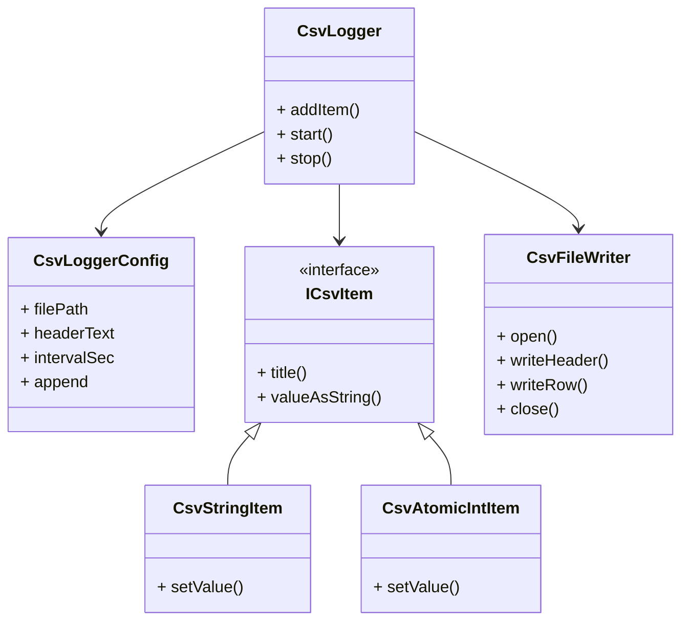

# CSV Snapshot Logger

Linux 환경에서 동작하는 **경량 주기 샘플링 로거**이다.  
외부에서 제공되는 값(item)을 일정 주기로 수집하여 CSV 파일 형태로 저장한다.

이 로거는 이벤트 발생 시마다 기록하는 방식이 아니라 **주기적으로 현재 상태(snapshot)를 기록하는 방식**이다.

---

## Features

- Linux 전용
- CSV 파일 저장
- 주기 기반 기록
- 파일 rotation 없음
- 파일 시작 시 header 기록
- 고정 컬럼 제공
- thread-safe 값 갱신 가능
- 낮은 부하 구조
- 단순하고 확장 가능한 구조

---

## CSV Format

### Column Structure

```text
uptime,system_time,<item1>,<item2>,...
```

### Fixed Columns

| column | description |
|---|---|
| uptime | Linux `/proc/uptime` 값 |
| system_time | 현재 시스템 시간 |

### Example

```csv
# device=LECU-A
# build=2026.04

uptime,system_time,speed,temp,mode
12345.67,2026-04-21 11:00:00,0,41,INIT
12346.67,2026-04-21 11:00:01,15,42,RUN
12347.67,2026-04-21 11:00:02,15,42,RUN
```

---

## Workflow

### Overall Flow

```text
Create CsvLogger
        ↓
Register items
        ↓
start()
        ↓
Periodic row generation
        ↓
CSV write
        ↓
stop()
```

### Periodic Operation

```text
loop
 ├─ read uptime (/proc/uptime)
 ├─ generate system time
 ├─ read item values
 ├─ build CSV row
 ├─ write file
 └─ sleep(intervalSec)
```

---

## Components

| Component | Role |
|---|---|
| CsvLogger | main controller |
| CsvLoggerConfig | configuration |
| ICsvItem | item interface |
| CsvStringItem | string value item |
| CsvAtomicIntItem | integer value item |
| CsvFileWriter | file writer |

---

## Class Design

### CsvLogger

#### Role

- periodically collect values
- generate CSV row
- manage worker thread
- generate uptime/system_time

#### Members

```cpp
CsvLoggerConfig           m_config;
std::vector<ICsvItem*>    m_items;
CsvFileWriter             m_writer;
std::thread               m_thread;
std::atomic<bool>         m_running;
std::atomic<bool>         m_stopRequested;
```

#### Methods

| method | description |
|---|---|
| addItem | register item |
| clearItems | remove items |
| start | start logger |
| stop | stop logger |
| run | worker loop |
| buildRowValues | create CSV row |
| readProcUptime | read Linux uptime |
| makeSystemTimeString | create system time |

### CsvLoggerConfig

#### Role

configuration container

#### Members

| field | description |
|---|---|
| filePath | output file path |
| headerText | header text |
| intervalSec | logging interval |
| append | append mode |

### ICsvItem

#### Role

interface used by logger to read values

#### Interface

```cpp
title()
valueAsString()
```

### CsvStringItem

#### Role

string value item

#### Features

- mutex based thread-safe
- used for textual state values

### CsvAtomicIntItem

#### Role

integer value item

#### Features

- atomic based
- lock-free update
- suitable for frequent updates

### CsvFileWriter

#### Role

CSV file output

#### Responsibilities

| method | description |
|---|---|
| open | open file |
| writeHeader | write header |
| writeRow | write CSV row |
| close | close file |

---

## Thread Model

```text
main thread
 ├─ update item values
 └─ start CsvLogger

CsvLogger worker thread
 └─ periodic CSV write
```

---

## Linux Dependency

### uptime source

```text
/proc/uptime
```

example:

```text
12345.67 54321.00
```

first value is used:

```text
12345.67
```

### system time format

```text
YYYY-MM-DD HH:MM:SS
```

example:

```text
2026-04-21 11:00:01
```

---

## Limitations

- Linux only
- snapshot logging (not event logging)
- no file rotation
- single output file

---

## Possible Extensions

### additional item types

- CsvAtomicDoubleItem
- CsvAtomicFloatItem
- CsvAtomicEnumItem

### additional features

- log only when value changes
- flush interval control
- file size limit
- gzip compression
- millisecond timestamp
- configurable delimiter

---

## Class Diagram

> Mermaid를 지원하는 Markdown 렌더러에서 아래 다이어그램이 시각적으로 표시된다.

